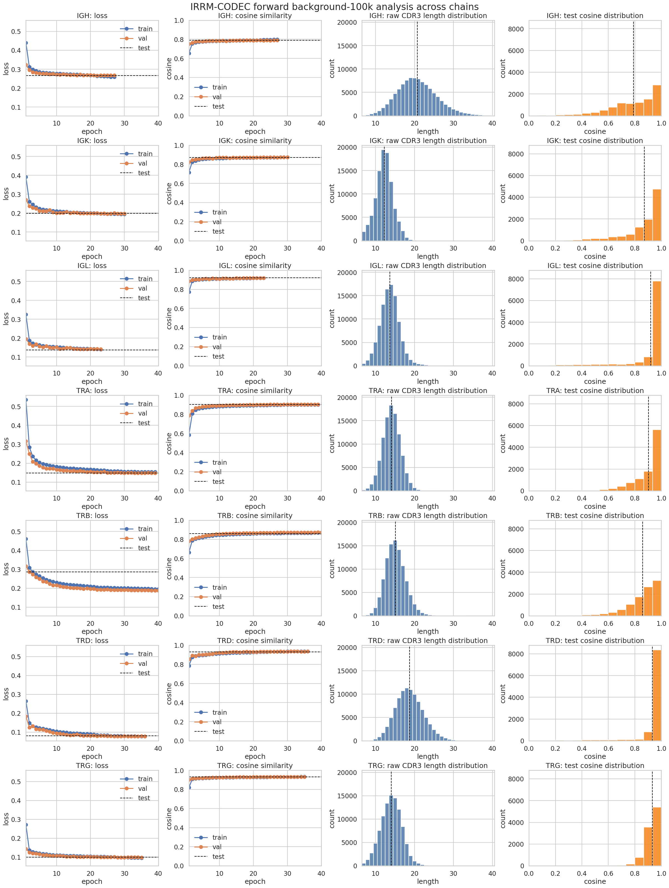
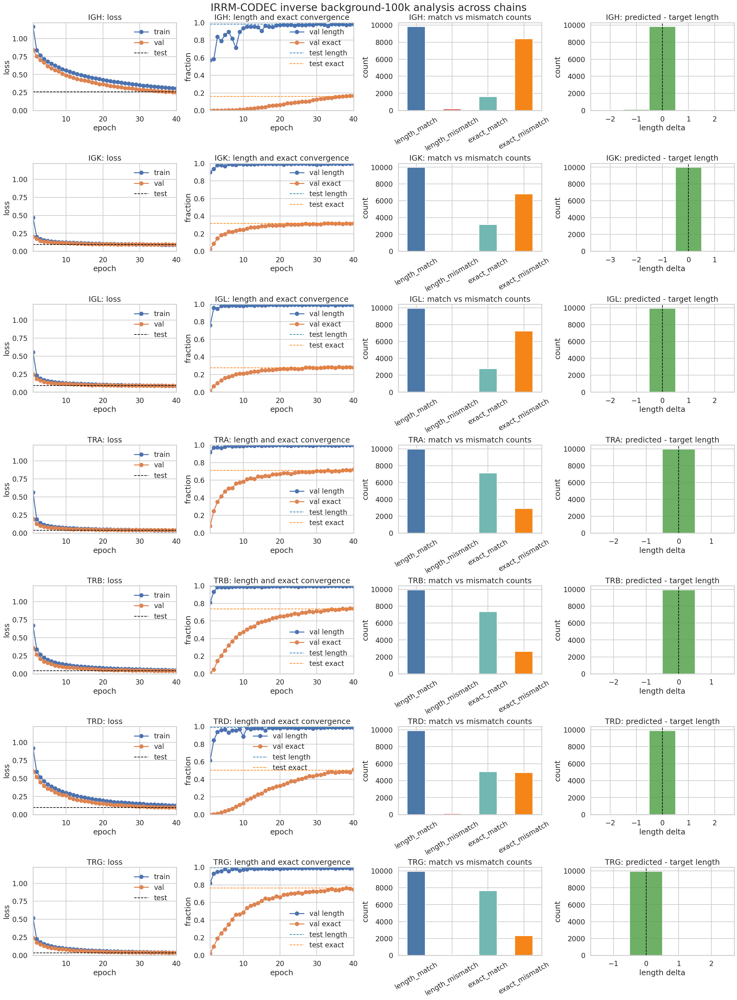
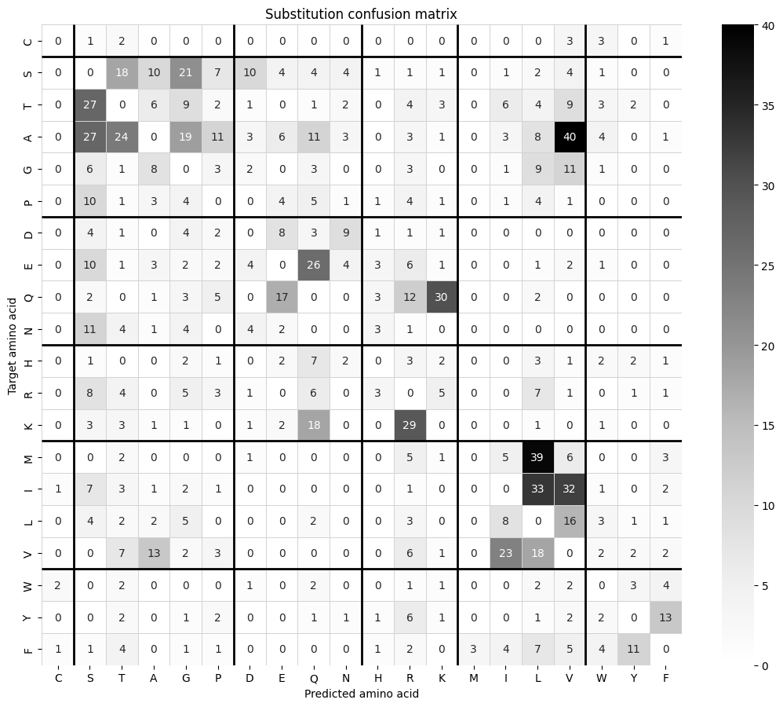
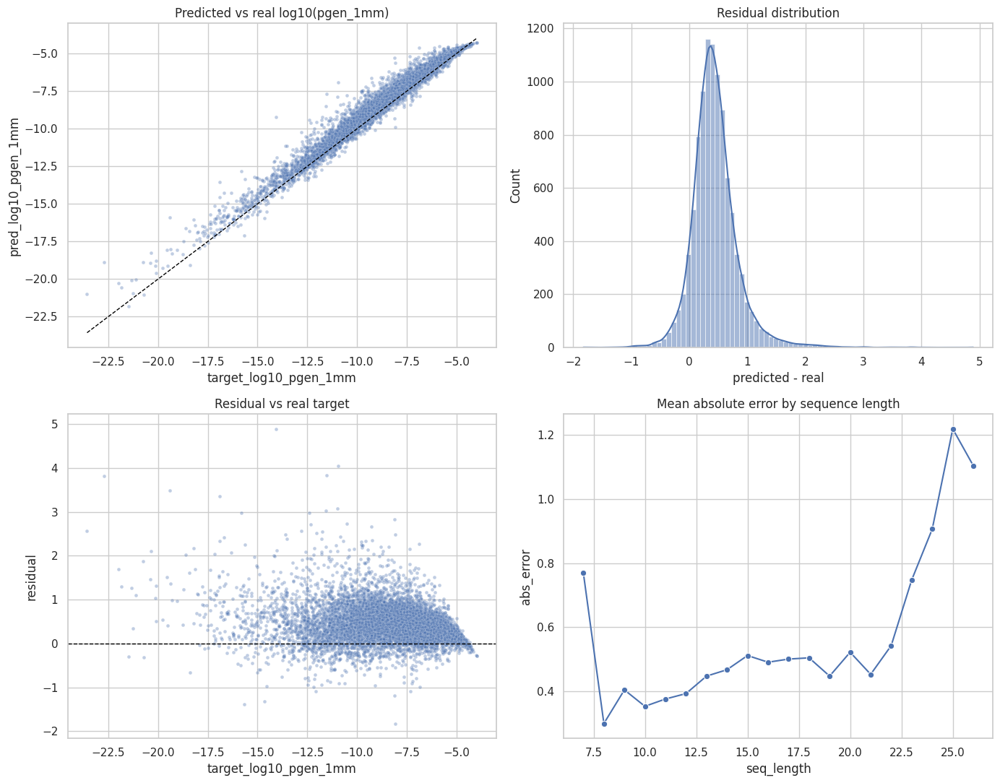
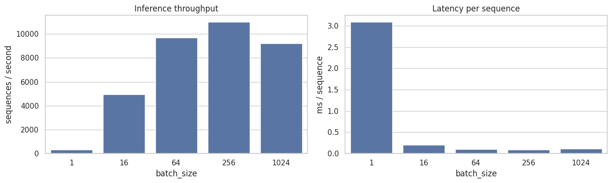

# irrm-codec

Immune Receptor Rearrangement Model-based enCOder DECoder (IRRM-CODEC).

`irrm-codec` contains two neural models for working with TCR CDR3 amino-acid sequences and TCRemP embeddings:

- forward model: predicts a TCRemP embedding from CDR3 sequence input
- inverse model: reconstructs a CDR3 sequence from a TCRemP embedding

The repository is organized as a small training package with Python entrypoints, Slurm launchers, and analysis notebooks for both single-run and multi-chain workflows.

## Repository layout

- `irrm_codec/`: package with data loading, tokenization, datasets, models, losses, utilities and training entrypoints
- `scripts/`: operational launchers; `train_forward.sh` and `train_inverse.sh` are Slurm array jobs for the seven background-100k chains, while `calc_pgen_1mm.sh` and `train_pgen.sh` are local bash wrappers around the Python modules
- `slurm/`: additional single-job and array-job `sbatch` examples plus `slurm/README.md` with cluster usage notes
- `notebooks/`: runnable notebooks for training walkthroughs, artifact inspection, pgen analysis, and cross-chain summaries
- `notebooks/projects/immunestatus/vdjrearm/airr_format/`: checked-in AIRR examples used by some notebooks as local fallback inputs
- `artifacts/`: default output directory for checkpoints and run metadata

## Environment setup

Create the conda environment:

```bash
conda create -n irrm-codec python=3.11 -y
conda activate irrm-codec
pip install -r requirements.txt
```

`requirements.txt` pins `torch==2.4.1` and adds the PyTorch `cu121` wheel index to avoid pulling newer CUDA 13 builds that may require a newer NVIDIA driver.
For pgen workflows, `requirements.txt` installs `mirpy-lib` directly from the
`antigenomics/mirpy` GitHub repository because the required API is newer than the
currently usable PyPI release in this workflow.

Update the environment after dependency changes:

```bash
pip install -r requirements.txt --upgrade
```

Register the environment as a Jupyter kernel:

```bash
python -m ipykernel install --user --name irrm-codec --display-name "Python (irrm-codec)"
```

Project dependencies, including notebook packages, are installed from [requirements.txt](/c:/Users/lizzka239/projects/irrm-codec/requirements.txt).

## Input data

Training expects two separate input files, following the same general idea as the `tcrempnet` workflow.

### 1. AIRR repertoire table

Accepted formats:

- `.tsv`
- `.airr`
- `.csv`
- `.parquet`

Required columns:

- `junction_aa`
- `v_call`
- `j_call`
- `locus`

Optional:

- `clone_id`

### 2. TCRemP embeddings parquet

Required:

- parquet file

Supported embedding layouts:

- one column with vector values, for example `tcremp_emb`
- many numeric embedding columns plus `clone_id`

If AIRR contains `clone_id`, the AIRR table and embeddings table are merged by `clone_id`. If AIRR does not contain `clone_id` but the two tables have the same number of rows, embeddings are matched to AIRR rows by row order.

## Training

Run the training modules directly for local or notebook-driven experiments:

```bash
python -m irrm_codec.train_forward \
  --airr-path data/sample_airr.tsv \
  --embeddings-path data/sample_embeddings.parquet \
  --locus alpha \
  --output-dir artifacts/forward

python -m irrm_codec.train_inverse \
  --airr-path data/sample_airr.tsv \
  --embeddings-path data/sample_embeddings.parquet \
  --locus alpha \
  --output-dir artifacts/inverse
```

For cluster runs, use the Slurm launchers:

- `scripts/train_forward.sh`: 7-chain array job for forward training on the background-100k layout
- `scripts/train_inverse.sh`: 7-chain array job for inverse training on the background-100k layout
- `slurm/train_forward.sbatch`: single forward run with overridable paths and hyperparameters
- `slurm/train_pgen_background_100k_array.sbatch`: array launcher for one pgen regressor per chain after pgen preprocessing

Examples:

```bash
sbatch scripts/train_forward.sh
sbatch scripts/train_inverse.sh
```

Useful optional flags:

- `--clone-id-col clone_id`
- `--embedding-column tcremp_emb`
- `--wandb-project irrm-codec`
- `--wandb-entity ...`
- `--wandb-run-name ...`
- `--wandb-dir ...`
- `--wandb-mode online|offline|disabled`
- `--max-len 40`
- `--batch-size ...`
- `--epochs ...`
- `--seed 42`
- `--log-interval 10`
- `--no-progress`

### Architecture hyperparameters

The `forward` and `inverse` training entrypoints also expose model-architecture
parameters so they can be tuned directly from CLI, W&B sweeps, or Slurm jobs.

#### Forward model

- `--token-embedding-dim`: size of the learned amino-acid token embedding before
  convolutional encoding. Larger values increase model capacity in the first
  layer and slightly increase memory use.
- `--hidden-dim`: width of the convolutional encoder. This is one of the main
  capacity controls for the forward model.
- `--mlp-dim`: width of the first projection layer after sequence pooling.
  Increasing it gives the head more room to combine pooled features.
- `--mlp-hidden-dim`: width of the second projection layer in the prediction
  head before the final embedding output.
- `--dropout`: dropout rate used inside the convolution blocks and MLP head.
  Higher values regularize more strongly but can slow fitting.
- `--dilations`: comma-separated dilation schedule for the convolution blocks,
  for example `1,2,4,8`. Larger or longer schedules increase receptive field.
- `--encoder-type`: encoder block family. `residual` usually trains more
  stably at higher capacity, while `plain_conv` is simpler and sometimes faster.

#### Inverse model

- `--hidden-dim`: transformer hidden width after projecting the TCRemP
  embedding. This is the main width parameter of the inverse decoder.
- `--dropout`: dropout rate in the embedding projection and transformer blocks.
- `--num-layers`: number of transformer encoder layers used in the parallel
  sequence decoder. More layers increase depth and compute.
- `--nhead`: number of attention heads in each transformer layer. Must stay
  compatible with `hidden-dim`.
- `--ff-mult`: feed-forward expansion multiplier inside each transformer layer.
  The inner feed-forward size is `hidden_dim * ff_mult`.

In practice, the most influential architecture knobs are usually:

- forward: `hidden-dim`, `dropout`, `encoder-type`, `dilations`
- inverse: `hidden-dim`, `dropout`, `num-layers`

## 1mm pgen calculation

Use the dedicated module to compute 1-mismatch pgen values through `mirpy`'s
`mir.basic.pgen.OlgaModel.compute_pgen_junction_aa_1mm`.

Example:

```bash
python -m irrm_codec.calc_pgen_1mm \
  --airr-path data/sample_airr.tsv \
  --output-path artifacts/pgen/sample_airr_pgen.tsv \
  --chain TRB \
  --species human \
  --locus beta \
  --threads 8 \
  --chunk-size 1000
```

Notes:

- `--threads` controls how many independent worker processes run in parallel.
- Each worker gets its own contiguous part of the filtered AIRR table, reads the AIRR file inside the child process, and never receives a shared in-memory sequence list from the parent.
- `--chunk-size` controls how many sequences a worker processes before flushing an intermediate result chunk to disk.
- Completed chunks are reused on rerun, so a killed job resumes from the last successful on-disk save.
- The output table keeps the original AIRR columns and appends `pgen_1mm` and `log10_pgen_1mm`.
- The code is compatible with the current `mirpy-lib` package and falls back to a local checkout at `../mirpy` when needed.

The matching local bash wrapper is:

```bash
AIRR_PATH=data/sample_airr.tsv \
OUTPUT_PATH=artifacts/pgen/sample_airr_pgen.tsv \
CHAIN=TRB \
LOCUS=beta \
bash scripts/calc_pgen_1mm.sh
```

## Sequence to log10(pgen) regression

Use the dedicated training module to fit a scalar regressor from CDR3 sequence to `log10_pgen_1mm`.

Example:

```bash
python -m irrm_codec.train_pgen \
  --airr-path artifacts/pgen/sample_airr_pgen.tsv \
  --output-dir artifacts/pgen_model/trb \
  --target-col log10_pgen_1mm \
  --locus beta \
  --batch-size 256 \
  --epochs 40
```

Notes:

- The model reuses the sequence encoder structure from the forward model and predicts one scalar per clonotype.
- The training target is taken directly from the AIRR table, so pgen preprocessing must be run first.
- Metrics include Huber loss, RMSE, and MAE.
- W&B logging can be configured with `--wandb-project`, `--wandb-entity`, `--wandb-run-name`, `--wandb-dir`, and `--wandb-mode`.

The matching local bash wrapper is:

```bash
AIRR_PATH=artifacts/pgen/sample_airr_pgen.tsv \
OUTPUT_DIR=artifacts/pgen_model/trb \
LOCUS=beta \
bash scripts/train_pgen.sh
```

## What the forward and inverse training scripts do

The forward and inverse training modules:

- load AIRR and embeddings from separate files
- align them by `clone_id` or by row order when `clone_id` is absent and row counts match
- filter by `locus`
- validate sequence and embedding inputs
- split data into train, validation and test subsets
- fit embedding normalization on the train split only
- save normalization parameters for later inference
- save both the best and the latest model checkpoints
- write per-epoch history and final test metrics
- log train, validation, and test metrics to Weights & Biases

The pgen regressor follows the same split, checkpoint, and metrics pattern, but it reads a single AIRR table with a target column instead of a separate embeddings parquet and it does not save embedding normalization arrays.

For remote runs, configure W&B with environment variables before launching training:

```bash
export WANDB_API_KEY=...
export WANDB_ENTITY=...
export WANDB_PROJECT=irrm-codec
```

If the server cannot reach the internet during training, you can log locally first and sync later:

```bash
export WANDB_MODE=offline
wandb sync path/to/wandb/offline-run
```

## Saved artifacts

Forward and inverse runs write to their output directories, for example `artifacts/forward` or `artifacts/inverse`.

Saved files:

- `best.pt`: checkpoint with the best validation loss
- `last.pt`: checkpoint from the final epoch
- `mean.npy`: train-split embedding mean
- `std.npy`: train-split embedding standard deviation
- `history.json`: epoch-by-epoch training and validation metrics
- `test_metrics.json`: final metrics on the test split
- `data_stats.json`: dataset summary, merge statistics and artifact paths

Pgen runs follow the same layout except that they do not write `mean.npy` and `std.npy`.

## Where to find trained models

If you ran training locally from the CLI or notebooks, look in the output directory you passed with `--output-dir`. The defaults and common examples in this repository are:

- forward demo run: `artifacts/forward` or `artifacts/forward_demo_trb`
- inverse demo run: `artifacts/inverse` or `artifacts/inverse_demo_trb`
- pgen demo run: `artifacts/pgen_model/trb`

If you ran the cluster launchers that are currently checked into the repo, the model roots are:

- forward background-100k array runs: `/projects/immunestatus/vdjrearm/irrmcodec/forward_background_100k/<chain>`
- inverse background-100k array runs: `/projects/immunestatus/vdjrearm/irrmcodec/inverse_background_100k/<chain>`
- pgen background-100k array runs: `/projects/immunestatus/vdjrearm/irrmcodec/pgen_background_100k/<chain>`

For example:

- `/projects/immunestatus/vdjrearm/irrmcodec/forward_background_100k/trb`
- `/projects/immunestatus/vdjrearm/irrmcodec/inverse_background_100k/trb`
- `/projects/immunestatus/vdjrearm/irrmcodec/pgen_background_100k/trb`

Supported chain directory names in the multi-chain runs are:

- `igh`
- `igk`
- `igl`
- `tra`
- `trb`
- `trd`
- `trg`

Inside each model directory, the main files to look for are `best.pt` and `last.pt`. The surrounding metadata is stored alongside them: `history.json`, `test_metrics.json`, `data_stats.json`, and for forward/inverse also `mean.npy` and `std.npy`.

## Results

The committed `main` branch already contains executed summary notebooks for:

- forward multi-chain evaluation: `notebooks/forward_background_100k_multichain_analysis.ipynb`
- inverse multi-chain evaluation: `notebooks/inverse_background_100k_multichain_analysis.ipynb`
- pgen regression quality and inference speed: `notebooks/pgen_run_and_analysis.ipynb`

### Forward model on background-100k

Cross-chain summary over `igh`, `igk`, `igl`, `tra`, `trb`, `trd`, `trg`:

- mean recomputed test loss: `0.1741`
- mean recomputed test cosine: `0.8871`
- best cosine: `trg = 0.9323`, closely followed by `trd = 0.9320` and `igl = 0.9202`
- lowest recomputed test loss: `trd = 0.0805`
- hardest chains in this sweep: `igh` (`cosine = 0.7906`) and `trb` (`eval_test_loss = 0.2868`)

| chain | epochs_ran | best_val_loss | eval_test_loss | eval_test_cosine |
| --- | ---: | ---: | ---: | ---: |
| igh | 27 | 0.2669 | 0.2668 | 0.7906 |
| igk | 30 | 0.1968 | 0.1987 | 0.8712 |
| igl | 23 | 0.1411 | 0.1381 | 0.9202 |
| tra | 39 | 0.1473 | 0.1484 | 0.9035 |
| trb | 40 | 0.1871 | 0.2868 | 0.8599 |
| trd | 36 | 0.0775 | 0.0805 | 0.9320 |
| trg | 35 | 0.0981 | 0.0995 | 0.9323 |

Training dynamics and test distributions across chains:



### Inverse model on background-100k

Cross-chain summary over the same seven chains:

- mean test loss: `0.0936`
- mean token accuracy: `0.9723`
- mean length accuracy: `0.9920`
- mean exact match: `0.4962`
- best exact-match chains: `trg = 0.7658`, `trb = 0.7371`, `tra = 0.7112`
- lowest exact-match chain: `igh = 0.1614`

| chain | loss | token_accuracy | length_accuracy | exact_match |
| --- | ---: | ---: | ---: | ---: |
| igh | 0.2589 | 0.9199 | 0.9798 | 0.1614 |
| igk | 0.0958 | 0.9739 | 0.9963 | 0.3178 |
| igl | 0.0896 | 0.9740 | 0.9937 | 0.2766 |
| tra | 0.0369 | 0.9907 | 0.9977 | 0.7112 |
| trb | 0.0407 | 0.9884 | 0.9937 | 0.7371 |
| trd | 0.0985 | 0.9697 | 0.9895 | 0.5036 |
| trg | 0.0349 | 0.9895 | 0.9931 | 0.7658 |

Training dynamics, convergence of length/exact-match, and mismatch counts across chains:



Letter-level substitution errors from the executed TRB inverse-analysis notebook:



### Pgen regression on TRB

Saved notebook metrics on the 10k test split:

- `RMSE = 0.5914`
- `MAE = 0.4731`
- `bias = 0.4399`
- `Pearson r = 0.9874`
- `Spearman rho = 0.9861`
- `R^2 = 0.9437`

| RMSE | MAE | bias | Pearson r | Spearman rho | R^2 | n_test |
| ---: | ---: | ---: | ---: | ---: | ---: | ---: |
| 0.5914 | 0.4731 | 0.4399 | 0.9874 | 0.9861 | 0.9437 | 10000 |



### Inference-speed benchmark for the pgen predictor

The committed notebook benchmark was executed on `CPU` and reports throughput and per-sequence latency on the 10k TRB test split:

- batch `1`: `324.0 seq/s`, `3.086 ms/sequence`
- batch `16`: `4934.1 seq/s`, `0.203 ms/sequence`
- batch `64`: `9705.4 seq/s`, `0.103 ms/sequence`
- batch `256`: `11001.8 seq/s`, `0.0909 ms/sequence`
- batch `1024`: `9230.5 seq/s`, `0.1083 ms/sequence`

The best throughput in this saved benchmark is at `batch_size = 256`.

| batch_size | seq_per_second | ms_per_sequence |
| ---: | ---: | ---: |
| 1 | 324.0 | 3.0860 |
| 16 | 4934.1 | 0.2027 |
| 64 | 9705.4 | 0.1030 |
| 256 | 11001.8 | 0.0909 |
| 1024 | 9230.5 | 0.1083 |



## Notebook map

Main notebooks live in `notebooks/` and are split by workflow:

- `notebooks/example_run_and_analysis.ipynb`: forward-model walkthrough from input inspection to training, metrics, plots, and checkpoint restore
- `notebooks/example_inverse_run_and_analysis.ipynb`: inverse-model analogue of the forward walkthrough
- `notebooks/pgen_run_and_analysis.ipynb`: analysis notebook for trained sequence-to-`log10_pgen_1mm` models, including residual plots and inference timing
- `notebooks/forward_background_100k_multichain_analysis.ipynb`: aggregate evaluation for all saved forward background-100k runs
- `notebooks/inverse_background_100k_multichain_analysis.ipynb`: aggregate evaluation for all saved inverse background-100k runs
- `notebooks/generate_datasets.ipynb`: helper notebook for preparing prototype AIRR datasets for IGH, IGK, IGL, TRD, and TRG
- `notebooks/trb_1kk.ipynb`: compact TRB forward-run demo

Historical or scratch material:

- `notebooks/example_run_and_analysis-Copy1.ipynb`: older copy of the forward walkthrough kept for reference

If you want one place to start, use:

- forward training: `notebooks/example_run_and_analysis.ipynb`
- inverse training: `notebooks/example_inverse_run_and_analysis.ipynb`
- pgen model analysis and timing: `notebooks/pgen_run_and_analysis.ipynb`

## How to test

There is currently no dedicated `pytest` suite in the repository, so validation is done through smoke checks plus notebook-backed end-to-end checks.

Recommended checks after `pip install -r requirements.txt`:

```bash
python -m compileall irrm_codec
python -m irrm_codec.train_forward --help
python -m irrm_codec.train_inverse --help
python -m irrm_codec.calc_pgen_1mm --help
python -m irrm_codec.train_pgen --help
```

Recommended workflow checks:

1. Run one short forward training job with reduced epochs and confirm that `best.pt`, `last.pt`, `history.json`, `test_metrics.json`, and `data_stats.json` appear in the output directory.
2. Run one short inverse training job and check that `test_metrics.json` contains `token_accuracy`, `length_accuracy`, and `exact_match`.
3. Run `calc_pgen_1mm` on a small AIRR subset and confirm that the output table contains `pgen_1mm` and `log10_pgen_1mm`.
4. Train the pgen regressor on that output and check that `test_metrics.json` contains `rmse` and `mae`.
5. Open the matching notebook and verify that it can read the produced artifacts without manual file edits beyond the input-path cell.

If you are validating the cluster wrappers instead of local modules:

- submit `sbatch scripts/train_forward.sh` or `sbatch scripts/train_inverse.sh` for the 7-chain array jobs
- submit the examples from `slurm/README.md` for single-run forward or pgen workflows
- inspect logs under `slurm/logs/` or the cluster log directory configured in the script headers

## Notes

- The inverse model predicts the full fixed-length token sequence of length 40 in parallel.
- The current pipeline expects one chain at a time and uses `locus` filtering to select it.
- By default, CDR3 sequences are converted to fixed length 40 before tokenization by inserting `-` gaps after residue 4 and before the last 3 residues.
- Training outputs are intentionally ignored by git via [`.gitignore`](/c:/Users/lizzka239/projects/irrm-codec/.gitignore#L1).
